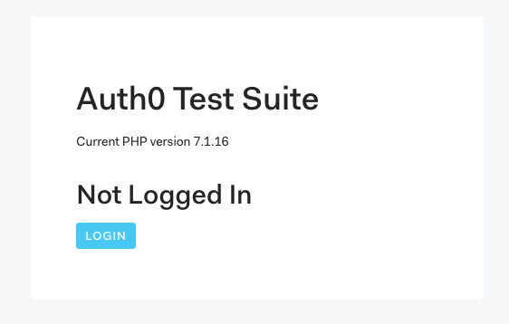

# Auth0 PHP Test
This "app" was made to explore, test, and develop the [Auth0 PHP SDK](https://github.com/auth0/auth0-PHP).

## Installation

This project uses Composer to autoload Auth0 and the classes it uses. Clone this repo somewhere and `cd` into it. Once that is complete, install Composer (if installed globally):

```
composer install
```

Otherwise, [download Composer locally](https://getcomposer.org/doc/00-intro.md#locally) and run:

```
php composer.phar install
``` 

Copy the `example.env` file to `.env` and replace the values there with what's on your [Application](https://manage.auth0.com/#/applications) settings screen in the Auth0 dashboard (click **Create Application** if you're starting from scratch).

Now clone the Auth0 repo and composer install there:

```
> git clone https://github.com/auth0/auth0-PHP.git auth0
> cd auth0
> composer install 
> cd ..
```

Now, run the [built-in PHP server](https://secure.php.net/manual/en/features.commandline.webserver.php) and you're ready to go:

```
php -S localhost:5000
```

Visit [http://localhost:5000](http://localhost:5000) in your browser and you should see something like this:



## Usage

Everything is loaded up in `bootstrap.php` and output in `index.php`. The `/classes/` directory contains simple examples of how to use the Management API and you'll see those output at the bottom of `index.php`. 

All the code samples in the [SDK README](https://github.com/auth0/auth0-PHP/blob/master/README.md) are here in files prefixed with `readme-` so you can run and modify them yourself.